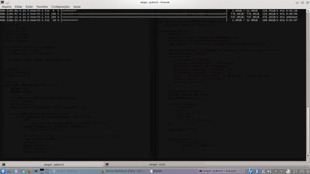

# aioget
This is a simple script that implements concurrent downloads with Python.
It makes use of Python >= 3.5 new module's asyncio coroutines with async / await statements.
Uses aiohttp for assyncronous downloads, aiofiles for nonblocking filesystem operations.
Has a nice curses based progress_bar with multiple lines

# Requirements
* python >= 3.5
* aiohttp
* aiofiles
* blessings

Only works on POSIX systems (Linux, BSD, ios, etc...)

# Usage

    aioget "url1" "url2" ... "url n"
    
or read urls from file:
    
    aioget -f urllist.txt

